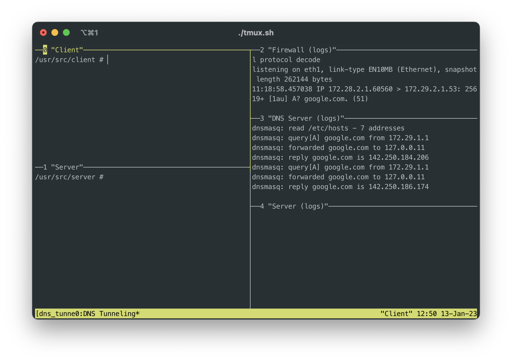

# Cyber Security Project: DNS Tunneling


## Protocol

Client and server communicate over a custom protocol on top of DNS.
The full protocol specification can be found [here](doc/protocol.md).

## Testing Environment

This repository comes with docker testing environment, that demonstrates the usage of the developed components in a
virtual network of Docker containers.

### Prerequisites

The following software is required to start the testing environment that comes with this repository

- bash
- Docker
- docker-compose
- tmux

### Usage Instructions

The environment can be started with docker-compose:

```sh
docker-compose up -d
```

A predefined tmux session is provided to interact with the system:

```sh
./tmux.sh
```

The started session will look like this:

<video width="390" controls>
  <source src="doc/img/tmux_demo.mov">
  
</video>

The focus in tmux can be changed by pressing <kbd>STRG</kbd> + <kbd>B</kbd> 
and then <kbd>↑</kbd>,<kbd>↓</kbd>,<kbd>→</kbd>,<kbd>←</kbd> to switch to another pane.

The tmux session can be ended by pressing <kbd>STRG</kbd> + <kbd>B</kbd> 
and then <kbd>&</kbd> and then <kbd>y</kbd>.

The testing environment can be ended like this:
```sh
docker-compose down
```

## Specific Client Instructions
[Client README](./client/README.md)

## Specific Server Instructions
[Server README](./server/README.md)