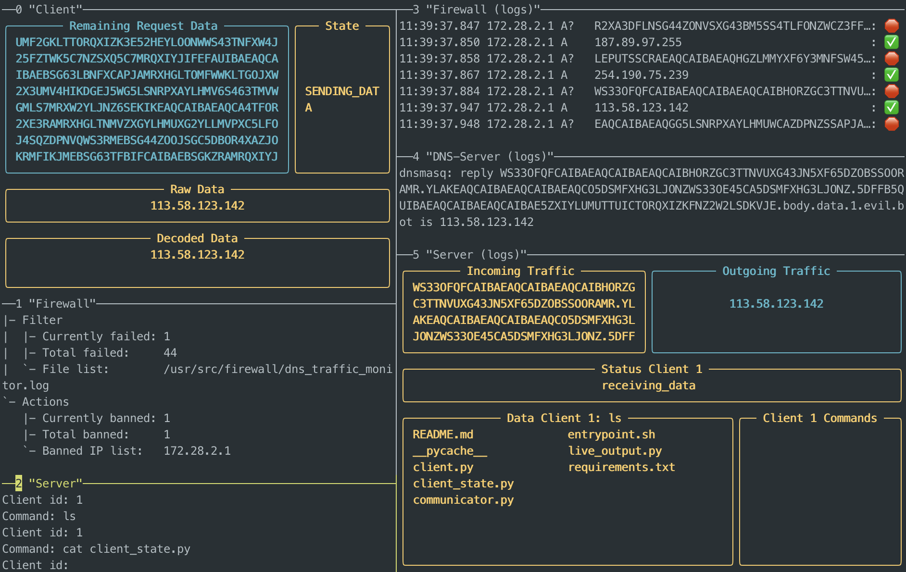

# Cyber Security Project: DNS Tunneling

Source code from the Cyber Security Project "DNS Tunneling - Attack and Defense".

This repository contains a reference implementation of a client and server that can be used to execute DNS tunneling for going around firewall blockades or to do a command and control attack.

Use at your own risk!



## Server and Client

Server and client are used to execute the attack. The server must be publicly available in the internet and masquerades itself as a DNS nameserver.

A client inside a private network must be infected with the client. Once installed, the client can execute different tasks:

1. Wait for commands from the server (command & control)
2. Download resources from the internet
3. Send data to the server

Usage documentation can be found here:

- [Client usage documentation](client/README.md)
- [Server usage documentation](server/README.md)

### Protocol

Client and server communicate over a custom protocol on top of DNS.
The full protocol specification can be found [here](doc/protocol.md).

## Firewall

A custom firewall module is provided that can detect and block the abuse of the DNS protocol.

The usage documentation [can be found here](firewall/README.md).

## Testing Environment

This repository comes with docker testing environment, that demonstrates the usage of the developed components in a
virtual network of Docker containers.

### Prerequisites

The following software is required to start the testing environment that comes with this repository

- bash
- Docker
- docker-compose
- tmux

### Usage Instructions

The environment can be started with docker-compose:

```sh
docker-compose up -d
```

A predefined tmux session is provided to interact with the system:

```sh
./tmux.sh
```

The started session will look like this:


The focus in tmux can be changed by pressing <kbd>STRG</kbd> + <kbd>B</kbd> 
and then <kbd>↑</kbd>,<kbd>↓</kbd>,<kbd>→</kbd>,<kbd>←</kbd> to switch to another pane.

The tmux session can be ended by pressing <kbd>STRG</kbd> + <kbd>B</kbd> 
and then <kbd>&</kbd> and then <kbd>y</kbd>.

The testing environment can be ended like this:
```sh
docker-compose down
```
